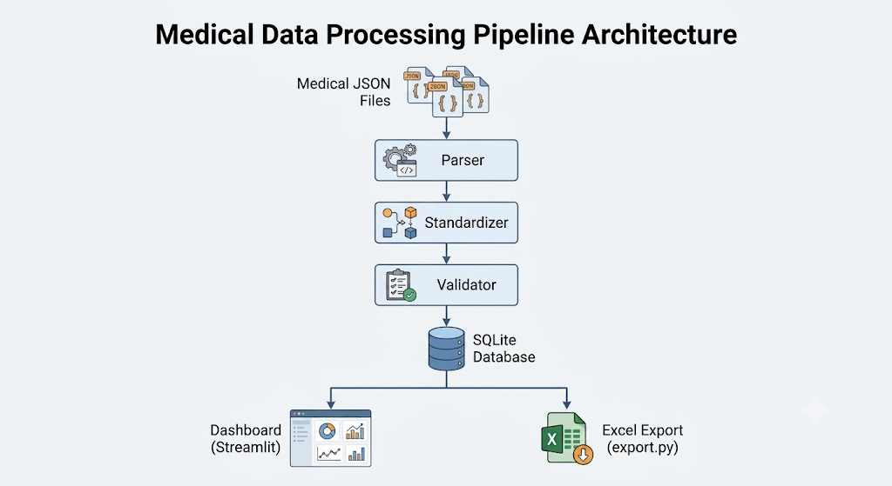

# System Architecture

## Architecture Diagram

## Overview

The Medical Data Standardization Pipeline processes medical JSON files through parsing, standardization, validation, storage in SQLite, dashboard visualization using Streamlit, and Excel export generation.

## Components

### Parser
- Reads medical JSON files from the sample-data folder.
- Extracts lab reports and discharge summaries.

### Standardizer
- Standardizes test names using test_name_mapping.json.
- Standardizes units using unit_mapping.json.

### Validator
- Performs invalid value checks.
- Performs unit validation.
- Performs outlier detection.

### Fault Tolerance
- Invalid or failed files are moved to the failed_files folder.
- Processing of one failed file does not stop processing of other files.
- Duplicate documents are skipped using document_id validation.

### SQLite Database
- Stores standardized records.

### Streamlit Dashboard
- Displays validation metrics and records.
- Supports JSON file upload and processing.

### Excel Export
- Generates standardized Excel output.